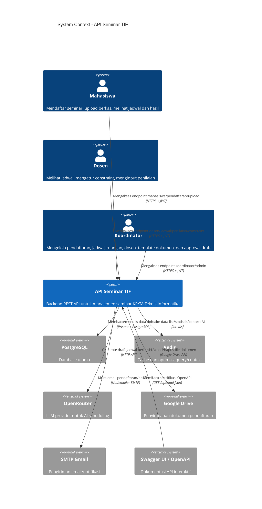
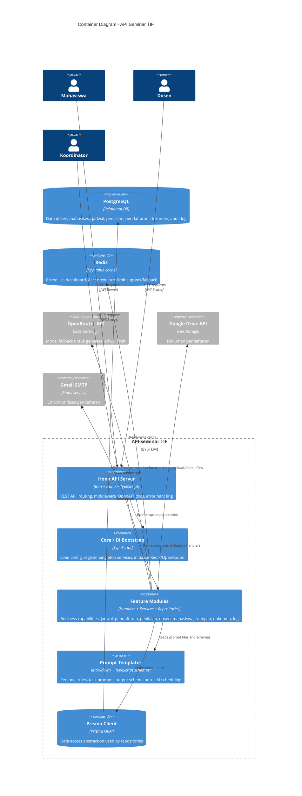
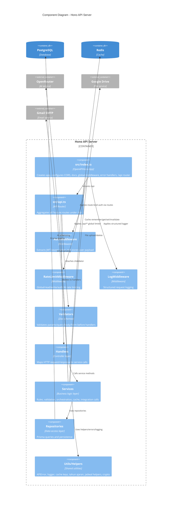

# Visualisasi Arsitektur — C4 Model

Project: **API SEMINAR TIF** (`hono-api-seminar`)  
Stack utama: **Bun**, **Hono/OpenAPIHono**, **Prisma**, **PostgreSQL**, **Redis**, **OpenRouter**, **Google Drive**, **SMTP Gmail**.

Dokumen ini memvisualisasikan arsitektur backend Sistem Manajemen Seminar KP & Tugas Akhir menggunakan pendekatan **C4 Model** yang dibatasi pada 3 level: **Context**, **Container**, dan **Component**.

---

## Level 1 — System Context

---

## Level 2 — Container Diagram

---

## Level 3 — Component Diagram: Hono API Server

---

## Level 3 — Component Diagram: Feature Modules

```mermaid
C4Component
    title Component Diagram - Feature Modules

    Person(mahasiswa, "Mahasiswa")
    Person(dosen, "Dosen")
    Person(koordinator, "Koordinator")

    Container_Boundary(features, "Feature Modules") {
        Component(global, "Global / Health Module", "Route + Handler", "Health check dan endpoint umum")
        Component(jadwal, "Jadwal Module", "Route + Validator + Handler + Service + Repository", "Manajemen jadwal seminar")
        Component(jadwalDraft, "Jadwal Draft AI Module", "Route + Validator + Handler + Service + Repository", "Generate, validasi, approval/rejection draft jadwal berbasis AI")
        Component(pendaftaran, "Pendaftaran Module", "Route + Validator + Handler + Service + Repository", "Pengajuan dan pengelolaan pendaftaran seminar")
        Component(penilaian, "Penilaian Module", "Route + Validator + Handler + Service + Repository", "Penilaian seminar dan detail komponen nilai")
        Component(dosenMod, "Dosen Module", "Route + Validator + Handler + Service + Repository", "Data dosen dan keahlian dosen")
        Component(mahasiswaMod, "Mahasiswa Module", "Route + Validator + Handler + Service + Repository", "Data mahasiswa")
        Component(ruangan, "Ruangan Module", "Route + Validator + Handler + Service + Repository", "Data ruangan seminar")
        Component(constraint, "Constraint Dosen Module", "Route + Validator + Handler + Service + Repository", "Batasan jadwal dosen")
        Component(master, "Master Data Modules", "Route + Validator + Handler + Service + Repository", "Jenis seminar, tahun ajaran, bobot penilai, bidang keahlian")
        Component(dokumen, "Dokumen Module", "Route + Validator + Handler + Service + Repository", "Template dan requirement dokumen")
        Component(upload, "Upload Module", "Route + Validator + Handler + Service", "Upload dokumen pendaftaran")
        Component(log, "Audit Log Module", "Route + Handler + Service + Repository", "Pencatatan perubahan entity domain")
    }

    ContainerDb(postgres, "PostgreSQL", "Relational DB")
    ContainerDb(redis, "Redis", "Key-value cache")
    Container_Ext(openrouter, "OpenRouter", "AI service")
    Container_Ext(gdrive, "Google Drive", "File storage")
    Container_Ext(smtp, "Gmail SMTP", "Email service")

    Rel(mahasiswa, pendaftaran, "Mengajukan pendaftaran")
    Rel(mahasiswa, jadwal, "Melihat jadwal")
    Rel(mahasiswa, upload, "Upload dokumen")
    Rel(mahasiswa, mahasiswaMod, "Mengelola data mahasiswa")
    Rel(dosen, jadwal, "Melihat jadwal")
    Rel(dosen, penilaian, "Input penilaian")
    Rel(dosen, constraint, "Mengatur constraint")
    Rel(dosen, dosenMod, "Mengelola data dosen")
    Rel(koordinator, jadwal, "Mengelola jadwal")
    Rel(koordinator, jadwalDraft, "Generate/approval draft AI")
    Rel(koordinator, pendaftaran, "Verifikasi pendaftaran")
    Rel(koordinator, master, "Mengelola master data")
    Rel(koordinator, dokumen, "Mengelola template/requirement")
    Rel(koordinator, ruangan, "Mengelola ruangan")
    Rel(koordinator, log, "Melihat audit log")

    Rel(jadwal, postgres, "Read/write jadwal")
    Rel(jadwalDraft, openrouter, "Generate draft jadwal")
    Rel(jadwalDraft, redis, "Cache context AI")
    Rel(jadwalDraft, postgres, "Persist draft")
    Rel(pendaftaran, postgres, "Read/write pendaftaran")
    Rel(pendaftaran, smtp, "Kirim notifikasi")
    Rel(upload, gdrive, "Upload/delete file")
    Rel(upload, postgres, "Simpan metadata file")
    Rel(penilaian, postgres, "Read/write penilaian")
    Rel(dosenMod, postgres, "Read/write dosen")
    Rel(mahasiswaMod, postgres, "Read/write mahasiswa")
    Rel(ruangan, postgres, "Read/write ruangan")
    Rel(constraint, postgres, "Read/write constraint")
    Rel(master, postgres, "Read/write master data")
    Rel(dokumen, postgres, "Read/write dokumen")
    Rel(log, postgres, "Persist audit log")
```

---

## Catatan Pembacaan Diagram

- Dokumentasi ini hanya memuat 3 level C4: **Context**, **Container**, dan **Component**.
- Diagram **C4Context**, **C4Container**, dan **C4Component** menggunakan sintaks Mermaid C4. Jika renderer Mermaid tidak memuat C4, gunakan Mermaid versi baru atau plugin yang mendukung C4.
- Dokumentasi ini disusun dari struktur source utama: `src/index.ts`, `src/api.ts`, `src/core/bootstrap.ts`, `src/infrastructures/*`, `src/modules/*`, dan `prisma/schema.prisma`.
